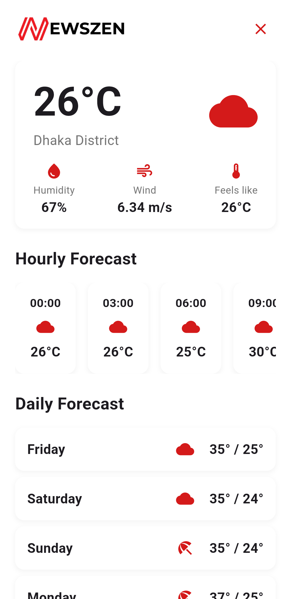

# NewsZen

---

***Note:** This repository represents a refactored and reorganized version of the project. The original development repository, containing earlier commit history, can be accessed [here](https://github.com/wasifuddin/NewsZen) for archival purposes.*

## Introduction

NewsZen is a cross-platform news aggregator and discovery application designed to keep users informed by consolidating content from diverse sources—including major news websites and social media feeds—into a single, unified interface.

It empowers users to filter and personalize their news experience through language selection, topical categories (national, international, sports, education, etc.), and custom tags. A built-in chatbot enhances interactivity by delivering real-time, on-demand news summaries.

With dynamic, responsive UI components, NewsZen offers intuitive features for liking, sharing, and sorting content by popularity, ensuring that the most relevant and engaging stories are always front and center.

## Features & Functionality

*   **Multi-Source Content Aggregation**: Gathers news and posts from various sources including traditional news outlets (via API) and social media platforms (Twitter/X, Facebook).
*   **Content Normalization**: Processes and standardizes data from different sources into a consistent format.
*   **Category Filtering**: Enables filtering content based on predefined categories (e.g., All, National, International, Politics, Business, Sports).
*   **Custom Tag Filtering**: Allows users to filter content using specific, user-relevant tags (e.g., Cricket, Islam, Education).
*   **Personalized Feed Ranking**: Ranks content in the user's feed based on their interaction history (likes, clicks, favorites).
*   **Popularity Sorting**: Provides options to sort the content feed based on metrics like 'most liked' or 'most clicked'.
*   **Article Liking/Favoriting**: Allows users to mark articles they like or find important.
*   **Chatbot News Query**: Offers a conversational interface where users can ask for news using natural language (e.g., "Give me recent news about NASA").
*   **Chatbot Results Display**: Shows top news results from the chatbot query, including source, date, and URL.
*   **User Authentication**: Supports user sign-up, sign-in (Email/Password), and logout.
*   **User Profile Management**: Allows users to edit their profile information (name, email, password).
*   **Article Bookmarking**: Enables users to save articles for later reading.
*   **Preferred Tag Management**: Allows users to maintain and quickly access a list of their favorite tags.

## Tech Stack

### Frontend
*   **Framework**: [Flutter](https://flutter.dev/) (for cross-platform mobile app development)
*   **IDE**: [Android Studio](https://developer.android.com/studio) (Ladybug v2024.2.1 used)
*   **State Management**: `bloc`
*   **UI/UX Packages**: `responsive_sizer`, `lottie`, `smooth_page_indicator`
*   **Utilities**: `equatable`, `permission_handler`, `jwt_decoder`, `geolocator`, `intl`

### Backend
*   **APIs / Scraping**:
    *   **Language**: [Python 3.8+](https://www.python.org/)
    *   **Web Scraping/Automation**: [Selenium](https://www.selenium.dev/), ChromeDriver, [BeautifulSoup (bs4)](https://www.crummy.com/software/BeautifulSoup/bs4/doc/)
    *   **HTTP Client**: `Requests`
    *   **Database Client**: `pymongo` (for MongoDB)
    *   **Utilities**: `csv`, `datetime`, `random`, `webdriver_manager`
*   **AI Chatbot**:
    *   **Vector Database**: [Qdrant](https://qdrant.tech/) (for similarity search)
    *   **Embeddings**: Gecko Embeddings (Multilingual)
    *   **Primary Data Source**: [MongoDB](https://www.mongodb.com/)
    *   **LLM Middleware/Evaluation**: OpenAI API
    *   **Response Generation**: GPT-4o

## How to Run

Follow these steps to set up and run the NewsZen application locally.

### Prerequisites
1.  **Flutter SDK**: Install the Flutter SDK from the [official Flutter website](https://flutter.dev/docs/get-started/install). Ensure the `flutter` command is available in your PATH.
2.  **Android Studio**: Install [Android Studio](https://developer.android.com/studio). Make sure to install the Flutter and Dart plugins (`File > Settings > Plugins`).
3.  **Android Emulator/Device**: Set up an Android Emulator via Android Studio (AVD Manager) or connect a physical Android device with USB debugging enabled.
4.  **Python**: Install Python 3.8 or newer from [python.org](https://www.python.org/downloads/).
5.  **Git**: Install [Git](https://git-scm.com/downloads).

### Backend Setup

The backend consists of two separate servers (API/Scraping and Chatbot) located in different branches of the repository. You need to clone the repository twice (or checkout branches into separate directories) and run both servers.

1.  **Clone the Repository (for API Backend)**:
    ```bash
    git clone https://github.com/rafiul-arefeen/newszen.git newszen-api-backend
    cd newszen-api-backend
    git checkout api_backend
    ```
2.  **Set up and Run API Backend**:
    *   Navigate to the specific directory containing the API server code within `newszen-api-backend`.
    *   Install node-modules.
    *   Run the API server with `npm run dev`.
    *   Note the IP address and port the server is running on (e.g., `http://127.0.0.1:5000`).

3.  **Clone the Repository (for Chatbot Backend)**:
    ```bash
    git clone https://github.com/rafiul-arefeen/newszen.git newszen-chatbot-backend
    cd newszen-chatbot-backend
    git checkout chatbot_backend
    ```
4.  **Set up and Run Chatbot Backend**:
    *   Navigate to the specific directory containing the Chatbot server code within `newszen-chatbot-backend`.
    *   Create and activate a virtual environment.
    *   Install dependencies.
    *   Configure any necessary API keys inside the file.
    *   Run the python file, this will start the chatbot server.
    *   Note the IP address and port (e.g., `http://127.0.0.1:8000`).

### Frontend Setup

1.  **Clone the Repository (Main/Frontend)**:
    ```bash
    git clone https://github.com/rafiul-arefeen/newszen.git newszen-app
    cd newszen-app
    # Ensure you are on the master branch containing the Flutter app code
    ```
2.  **Update Server Configuration**:
    *   Open the file `lib/config/server_config.dart` in your code editor.
    *   Update the server URLs to match the IP addresses and ports where your local backend servers are running.
        *   **Important:** If running the app on an emulator, use `http://10.0.2.2:<port>` instead of `http://127.0.0.1:<port>` to connect to your host machine's localhost.
        *   If running on a physical device connected to the same Wi-Fi, use your computer's local network IP address (e.g., `http://192.168.1.10:<port>`).
          
3.  **Install Flutter Packages**:
    ```bash
    flutter pub get
    ```
4.  **Run the App**:
    *   Make sure an emulator is running or a device is connected. Verify with `flutter devices`.
    *   Run the application:
        ```bash
        flutter run
        ```

The app should now build and launch on your selected device/emulator, connecting to your locally running backend services.

## Screenshots

| Login Screen                 | Home                 |
| :---------------------------: | :---------------------------: |
|  |  |
| **Notifications**              | **News Details**              |
|  |  |
| **Search Results**              | **Socials Screen**              |
|  |  |
| **Profile Screen**              | **Weather Screen**              |
|  |  |
| **Edit Profile Screen**              | **Screenshot 10**             |
|  | - |

---

## License

This project is licensed under the MIT License - see the [LICENSE](LICENSE) file for details.

---

## Collaborators

This is made as the final project for the course **CSE 4510: Software Development Lab** under the programme BSc in CSE, at Islamic University of Technology (IUT).

[Rihila Sumayya | 210041110](https://github.com/rihila)

[Rafiul Arefeen Islam | 210041114](https://github.com/rafiul-arefeen)

[Fateen Noor Rafee | 210041120](https://github.com/Fateennr)

[Nowshin Mahjabin | 210041128](https://github.com/Nowshiningg)

[Wasif Uddin | 210041144](https://github.com/wasifuddin)
